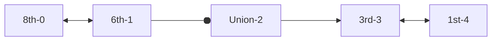
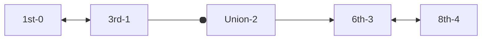

# MTA - Working Out

```rb
# Arrays
N_LINE = ["Times Square", "34th", "28th on N", "23rd on N", "Union Square","8th on N"]
L_LINE = ["8th on L", "6th", "Union Square", "3rd", "1st"]
SIX_LINE = ["Grand Central", "33rd", "28th on 6", "23rd on 6", "Union Square",  "Astor Place"]

# Functions
def single_trip(stop_one,stop_two)

# Variables - single_trip
stop_one # first station from argument/input
stop_one_index = L_LINE.index "#{stop_one}"
stop_two_index = L_LINE.index "#{stop_two}" 
num_of_stops = 3 
```

```rb
# Tests
single_trip('8th on L','Union Square') 
single_trip('3rd','6th')
```

Lets test with the l line



Two cases:

1) Going forwards (start will be less than the end)
   
   CONDITION = 
   
   single_trip('8th on L','Union Square')
   
   * Start at 8th (index 0)
   
   * **stop_one_index = 0**
   
   * 6th (index 1)
   
   * Union (index 2)
   
   * Stops: count from start to end 

2) Going backwards (start will be greater than the end)
   
   single_trip('3rd','6th')
   
   * starts at 3rd (index 3)
   
   * **stop_two_index = 3**
   
   * union (index 2)
   
   * 6th (index 1)
   
   * Stops: minus the start from the end
     
     * if **stop_two_index** > **stop_one_index**
     
     * **stops** = **stop_two_index** - **stop_one_index**

### 

## Ideas

### Getting the stations going backwards

* If we're going backwords then we can reverse the array

* Find out where we are 

* And then list the stations be##### Getting the stations going backwardstween them

["1st", "3rd", "Union Square", "6th", "8th on L"] 



### Listing all the stations in a loop

```rb
    # Tells the user what stations are on the line / change to stops between each other
    print "Stations include:"
    L_LINE.each do |stop|
        print "#{stop}"
    end
```

# MTA Lab - Instructions

## Objectives:

* Apply your knowledge of Ruby to solve a real world problem.
* Get really good at array manipulation.

#### Activity

* Create a program that models a simple subway system.

* The program takes the line and stop that a user is getting on at and the line
  and stop that user is getting off at and prints the journey and the total number of stops for the trip in the console:

```ruby
plan_trip 'N', 'Times Square', '6', '33rd' # This is only a suggested function name and signature.

# `puts` shows output similar to this:
# "You must travel through the following stops on the N line: 34th, 28th, 23rd, Union Square."
# "Change at Union Square."
# "Your journey continues through the following stops: 23rd, 28th, 33rd."
# "7 stops in total."
```

* There are 3 subway lines:
  * The N line has the following stops: Times Square, 34th, 28th, 23rd, Union Square, and 8th
  * The L line has the following stops: 8th, 6th, Union Square, 3rd, and 1st
  * The 6 line has the following stops: Grand Central, 33rd, 28th, 23rd, Union Square, and Astor Place.
  * All 3 subway lines intersect at Union Square, but there are no other intersection points. (For example, this means the 28th stop on the N line is different than the 28th street stop on the 6 line, so you'll have to differentiate this when you name your stops in the arrays.)
* Tell the user the number of stops AND the stops IN ORDER that they will pass through or change at.

#### Hints:

* Work out how you would do it on paper first! Then start to explain that process in Ruby.
* Get the program to work for a single line before trying to tackle multiple lines.
* Don't worry about prompting the user for input. Hard code some values to get it working. You can use ```gets``` later to make it more interactive.
* Consider diagramming the lines by sketching out the subway lines and their stops and intersection.
* The key to the lab is finding the index positions of each stop. (hint: ```index```)
* Make sure the stops that are the same for different lines have different names (i.e. 23rd on the N and on the 6 need to be differentiated)
