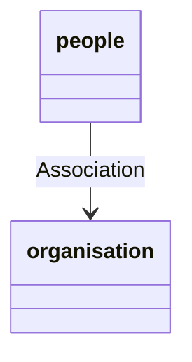

# Brief

Fun weekend homework! Create a brand new Sinatra CRUD application using ActiveRecord -- this time with two tables (AKA models). For example, an author has many books, a director has many films, a musician has many songs, a football team has many football players, a democratic nation has many war crimes, etc
reading: [Active Record Basics](https://guides.rubyonrails.org/v5.2/active_record_basics.html)

## Planning

1. Databases x 1
   1. People
   2. Organisations
   3. Investments?

## Reference

[Joel SEI60 Github Repo](https://github.com/wofockham/sei-60/tree/main/03-databases/butterflies-activerecord)

# Bonus

Bonus: try and associate the two tables.
to help you associate them, check out [Association Basics](https://guides.rubyonrails.org/v5.2/association_basics.html)