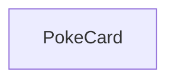

# Create a simple react app with an API

* Check if we can retrieve some infomation from:
    * https://pokeapi.co/.
    * Sample URL: https://pokeapi.co/api/v2/pokemon/ditto
    * https://pokeapi.co/api/v2/pokemon/3/
    * Endpoint URL: https://pokeapi.co/api/v2/pokemon/ 
## Get one bloody piece of data on the page
* then split into different components etc based on https://i.ebayimg.com/images/g/NREAAOSwhCdhXtHT/s-l1600.jpg
### Inital component


* Inital Data


## Example of call

```js
axios.get(flickrURL, { params: flickrParams }).then((response) => {
    const images = response.data.photos.photo.map(generateURL);
    this.setState({images: images});
});
```


Pokemon (endpoint)

Pokémon are the creatures that inhabit the world of the Pokémon games. They can be caught using Pokéballs and trained by battling with other Pokémon. Each Pokémon belongs to a specific species but may take on a variant which makes it differ from other Pokémon of the same species, such as base stats, available abilities and typings. See Bulbapedia for greater detail.

GET https://pokeapi.co/api/v2/pokemon/{id or name}/

id:35
name:"clefairy"
base_experience:113
height:6
is_default:true
order:56
weight:75

is_hidden:true
slot:3

        name:"friend-guard"
        url:"https://pokeapi.co/api/v2/ability/132/"

    name:"clefairy"
    url:"https://pokeapi.co/api/v2/pokemon-form/35/"

game_index:35

        name:"white-2"
        url:"https://pokeapi.co/api/v2/version/22/"

name:"moon-stone"
url:"https://pokeapi.co/api/v2/item/81/"

location_area_encounters:"/api/v2/pokemon/35/encounters"

name:"pound"
url:"https://pokeapi.co/api/v2/move/1/"

name:"clefairy"
url:"https://pokeapi.co/api/v2/pokemon-species/35/"

base_stat:35
effort:0

        name:"speed"
        url:"https://pokeapi.co/api/v2/stat/6/"

slot:1

        name:"fairy"
        url:"https://pokeapi.co/api/v2/type/18/"

name:"generation-v"
url:"https://pokeapi.co/api/v2/generation/5/"

View raw JSON (14.059 kB, 278 lines)
Pokemon (type)
Name	Description	Type
id	

The identifier for this resource.
	integer
name	

The name for this resource.
	string
base_experience	

The base experience gained for defeating this Pokémon.
	integer
height	

The height of this Pokémon in decimetres.
	integer
is_default	

Set for exactly one Pokémon used as the default for each species.
	boolean
order	

Order for sorting. Almost national order, except families are grouped together.
	integer
weight	

The weight of this Pokémon in hectograms.
	integer
abilities	

A list of abilities this Pokémon could potentially have.
	list PokemonAbility
forms	

A list of forms this Pokémon can take on.
	list NamedAPIResource (PokemonForm)
game_indices	

A list of game indices relevent to Pokémon item by generation.
	list VersionGameIndex
held_items	

A list of items this Pokémon may be holding when encountered.
	list PokemonHeldItem
location_area_encounters	

A link to a list of location areas, as well as encounter details pertaining to specific versions.
	string
moves	

A list of moves along with learn methods and level details pertaining to specific version groups.
	list PokemonMove
past_types	

A list of details showing types this pokémon had in previous generations
	list PokemonTypePast
sprites	

A set of sprites used to depict this Pokémon in the game. A visual representation of the various sprites can be found at PokeAPI/sprites
	PokemonSprites
species	

The species this Pokémon belongs to.
	NamedAPIResource (PokemonSpecies)
stats	

A list of base stat values for this Pokémon.
	list PokemonStat
types	

A list of details showing types this Pokémon has.
	list PokemonType
PokemonAbility (type)
Name	Description	Type
is_hidden	

Whether or not this is a hidden ability.
	boolean
slot	

The slot this ability occupies in this Pokémon species.
	integer
ability	

The ability the Pokémon may have.
	NamedAPIResource (Ability)
PokemonType (type)
Name	Description	Type
slot	

The order the Pokémon's types are listed in.
	integer
type	

The type the referenced Pokémon has.
	NamedAPIResource (Type)
PokemonFormType (type)
Name	Description	Type
slot	

The order the Pokémon's types are listed in.
	integer
type	

The type the referenced Form has.
	NamedAPIResource (Type)
PokemonTypePast (type)
Name	Description	Type
generation	

The last generation in which the referenced pokémon had the listed types.
	NamedAPIResource (Generation)
types	

The types the referenced pokémon had up to and including the listed generation.
	list PokemonType
PokemonHeldItem (type)
Name	Description	Type
item	

The item the referenced Pokémon holds.
	NamedAPIResource (Item)
version_details	

The details of the different versions in which the item is held.
	list PokemonHeldItemVersion
PokemonHeldItemVersion (type)
Name	Description	Type
version	

The version in which the item is held.
	NamedAPIResource (Version)
rarity	

How often the item is held.
	integer
PokemonMove (type)
Name	Description	Type
move	

The move the Pokémon can learn.
	NamedAPIResource (Move)
version_group_details	

The details of the version in which the Pokémon can learn the move.
	list PokemonMoveVersion
PokemonMoveVersion (type)
Name	Description	Type
move_learn_method	

The method by which the move is learned.
	NamedAPIResource (MoveLearnMethod)
version_group	

The version group in which the move is learned.
	NamedAPIResource (VersionGroup)
level_learned_at	

The minimum level to learn the move.
	integer
PokemonStat (type)
Name	Description	Type
stat	

The stat the Pokémon has.
	NamedAPIResource (Stat)
effort	

The effort points (EV) the Pokémon has in the stat.
	integer
base_stat	

The base value of the stat.
	integer
PokemonSprites (type)
Name	Description	Type
front_default	

The default depiction of this Pokémon from the front in battle.
	string
front_shiny	

The shiny depiction of this Pokémon from the front in battle.
	string
front_female	

The female depiction of this Pokémon from the front in battle.
	string
front_shiny_female	

The shiny female depiction of this Pokémon from the front in battle.
	string
back_default	

The default depiction of this Pokémon from the back in battle.
	string
back_shiny	

The shiny depiction of this Pokémon from the back in battle.
	string
back_female	

The female depiction of this Pokémon from the back in battle.
	string
back_shiny_female	

The shiny female depiction of this Pokémon from the back in battle.

{
  "id": 35,
  "name": "clefairy",
  "base_experience": 113,
  "height": 6,
  "is_default": true,
  "order": 56,
  "weight": 75,
  "abilities": [
    {
      "is_hidden": true,
      "slot": 3,
      "ability": {
        "name": "friend-guard",
        "url": "https://pokeapi.co/api/v2/ability/132/"
      }
    }
  ],
  "forms": [
    {
      "name": "clefairy",
      "url": "https://pokeapi.co/api/v2/pokemon-form/35/"
    }
  ],
  "game_indices": [
    {
      "game_index": 35,
      "version": {
        "name": "white-2",
        "url": "https://pokeapi.co/api/v2/version/22/"
      }
    }
  ],
  "held_items": [
    {
      "item": {
        "name": "moon-stone",
        "url": "https://pokeapi.co/api/v2/item/81/"
      },
      "version_details": [
        {
          "rarity": 5,
          "version": {
            "name": "ruby",
            "url": "https://pokeapi.co/api/v2/version/7/"
          }
        }
      ]
    }
  ],
  "location_area_encounters": "/api/v2/pokemon/35/encounters",
  "moves": [
    {
      "move": {
        "name": "pound",
        "url": "https://pokeapi.co/api/v2/move/1/"
      },
      "version_group_details": [
        {
          "level_learned_at": 1,
          "version_group": {
            "name": "red-blue",
            "url": "https://pokeapi.co/api/v2/version-group/1/"
          },
          "move_learn_method": {
            "name": "level-up",
            "url": "https://pokeapi.co/api/v2/move-learn-method/1/"
          }
        }
      ]
    }
  ],
  "species": {
    "name": "clefairy",
    "url": "https://pokeapi.co/api/v2/pokemon-species/35/"
  },
  "sprites": {
    "back_default": "https://raw.githubusercontent.com/PokeAPI/sprites/master/sprites/pokemon/back/35.png",
    "back_female": null,
    "back_shiny": "https://raw.githubusercontent.com/PokeAPI/sprites/master/sprites/pokemon/back/shiny/35.png",
    "back_shiny_female": null,
    "front_default": "https://raw.githubusercontent.com/PokeAPI/sprites/master/sprites/pokemon/35.png",
    "front_female": null,
    "front_shiny": "https://raw.githubusercontent.com/PokeAPI/sprites/master/sprites/pokemon/shiny/35.png",
    "front_shiny_female": null,
    "other": {
      "dream_world": {
        "front_default": "https://raw.githubusercontent.com/PokeAPI/sprites/master/sprites/pokemon/other/dream-world/35.svg",
        "front_female": null
      },
      "home": {
        "front_default": "https://raw.githubusercontent.com/PokeAPI/sprites/master/sprites/pokemon/other/home/35.png",
        "front_female": null,
        "front_shiny": "https://raw.githubusercontent.com/PokeAPI/sprites/master/sprites/pokemon/other/home/shiny/35.png",
        "front_shiny_female": null
      },
      "official-artwork": {
        "front_default": "https://raw.githubusercontent.com/PokeAPI/sprites/master/sprites/pokemon/other/official-artwork/35.png"
      }
    },
    "versions": {
      "generation-i": {
        "red-blue": {
          "back_default": "https://raw.githubusercontent.com/PokeAPI/sprites/master/sprites/pokemon/versions/generation-i/red-blue/back/35.png",
          "back_gray": "https://raw.githubusercontent.com/PokeAPI/sprites/master/sprites/pokemon/versions/generation-i/red-blue/back/gray/35.png",
          "front_default": "https://raw.githubusercontent.com/PokeAPI/sprites/master/sprites/pokemon/versions/generation-i/red-blue/35.png",
          "front_gray": "https://raw.githubusercontent.com/PokeAPI/sprites/master/sprites/pokemon/versions/generation-i/red-blue/gray/35.png"
        },
        "yellow": {
          "back_default": "https://raw.githubusercontent.com/PokeAPI/sprites/master/sprites/pokemon/versions/generation-i/yellow/back/35.png",
          "back_gray": "https://raw.githubusercontent.com/PokeAPI/sprites/master/sprites/pokemon/versions/generation-i/yellow/back/gray/35.png",
          "front_default": "https://raw.githubusercontent.com/PokeAPI/sprites/master/sprites/pokemon/versions/generation-i/yellow/35.png",
          "front_gray": "https://raw.githubusercontent.com/PokeAPI/sprites/master/sprites/pokemon/versions/generation-i/yellow/gray/35.png"
        }
      },
      "generation-ii": {
        "crystal": {
          "back_default": "https://raw.githubusercontent.com/PokeAPI/sprites/master/sprites/pokemon/versions/generation-ii/crystal/back/35.png",
          "back_shiny": "https://raw.githubusercontent.com/PokeAPI/sprites/master/sprites/pokemon/versions/generation-ii/crystal/back/shiny/35.png",
          "front_default": "https://raw.githubusercontent.com/PokeAPI/sprites/master/sprites/pokemon/versions/generation-ii/crystal/35.png",
          "front_shiny": "https://raw.githubusercontent.com/PokeAPI/sprites/master/sprites/pokemon/versions/generation-ii/crystal/shiny/35.png"
        },
        "gold": {
          "back_default": "https://raw.githubusercontent.com/PokeAPI/sprites/master/sprites/pokemon/versions/generation-ii/gold/back/35.png",
          "back_shiny": "https://raw.githubusercontent.com/PokeAPI/sprites/master/sprites/pokemon/versions/generation-ii/gold/back/shiny/35.png",
          "front_default": "https://raw.githubusercontent.com/PokeAPI/sprites/master/sprites/pokemon/versions/generation-ii/gold/35.png",
          "front_shiny": "https://raw.githubusercontent.com/PokeAPI/sprites/master/sprites/pokemon/versions/generation-ii/gold/shiny/35.png"
        },
        "silver": {
          "back_default": "https://raw.githubusercontent.com/PokeAPI/sprites/master/sprites/pokemon/versions/generation-ii/silver/back/35.png",
          "back_shiny": "https://raw.githubusercontent.com/PokeAPI/sprites/master/sprites/pokemon/versions/generation-ii/silver/back/shiny/35.png",
          "front_default": "https://raw.githubusercontent.com/PokeAPI/sprites/master/sprites/pokemon/versions/generation-ii/silver/35.png",
          "front_shiny": "https://raw.githubusercontent.com/PokeAPI/sprites/master/sprites/pokemon/versions/generation-ii/silver/shiny/35.png"
        }
      },
      "generation-iii": {
        "emerald": {
          "front_default": "https://raw.githubusercontent.com/PokeAPI/sprites/master/sprites/pokemon/versions/generation-iii/emerald/35.png",
          "front_shiny": "https://raw.githubusercontent.com/PokeAPI/sprites/master/sprites/pokemon/versions/generation-iii/emerald/shiny/35.png"
        },
        "firered-leafgreen": {
          "back_default": "https://raw.githubusercontent.com/PokeAPI/sprites/master/sprites/pokemon/versions/generation-iii/firered-leafgreen/back/35.png",
          "back_shiny": "https://raw.githubusercontent.com/PokeAPI/sprites/master/sprites/pokemon/versions/generation-iii/firered-leafgreen/back/shiny/35.png",
          "front_default": "https://raw.githubusercontent.com/PokeAPI/sprites/master/sprites/pokemon/versions/generation-iii/firered-leafgreen/35.png",
          "front_shiny": "https://raw.githubusercontent.com/PokeAPI/sprites/master/sprites/pokemon/versions/generation-iii/firered-leafgreen/shiny/35.png"
        },
        "ruby-sapphire": {
          "back_default": "https://raw.githubusercontent.com/PokeAPI/sprites/master/sprites/pokemon/versions/generation-iii/ruby-sapphire/back/35.png",
          "back_shiny": "https://raw.githubusercontent.com/PokeAPI/sprites/master/sprites/pokemon/versions/generation-iii/ruby-sapphire/back/shiny/35.png",
          "front_default": "https://raw.githubusercontent.com/PokeAPI/sprites/master/sprites/pokemon/versions/generation-iii/ruby-sapphire/35.png",
          "front_shiny": "https://raw.githubusercontent.com/PokeAPI/sprites/master/sprites/pokemon/versions/generation-iii/ruby-sapphire/shiny/35.png"
        }
      },
      "generation-iv": {
        "diamond-pearl": {
          "back_default": "https://raw.githubusercontent.com/PokeAPI/sprites/master/sprites/pokemon/versions/generation-iv/diamond-pearl/back/35.png",
          "back_female": null,
          "back_shiny": "https://raw.githubusercontent.com/PokeAPI/sprites/master/sprites/pokemon/versions/generation-iv/diamond-pearl/back/shiny/35.png",
          "back_shiny_female": null,
          "front_default": "https://raw.githubusercontent.com/PokeAPI/sprites/master/sprites/pokemon/versions/generation-iv/diamond-pearl/35.png",
          "front_female": null,
          "front_shiny": "https://raw.githubusercontent.com/PokeAPI/sprites/master/sprites/pokemon/versions/generation-iv/diamond-pearl/shiny/35.png",
          "front_shiny_female": null
        },
        "heartgold-soulsilver": {
          "back_default": "https://raw.githubusercontent.com/PokeAPI/sprites/master/sprites/pokemon/versions/generation-iv/heartgold-soulsilver/back/35.png",
          "back_female": null,
          "back_shiny": "https://raw.githubusercontent.com/PokeAPI/sprites/master/sprites/pokemon/versions/generation-iv/heartgold-soulsilver/back/shiny/35.png",
          "back_shiny_female": null,
          "front_default": "https://raw.githubusercontent.com/PokeAPI/sprites/master/sprites/pokemon/versions/generation-iv/heartgold-soulsilver/35.png",
          "front_female": null,
          "front_shiny": "https://raw.githubusercontent.com/PokeAPI/sprites/master/sprites/pokemon/versions/generation-iv/heartgold-soulsilver/shiny/35.png",
          "front_shiny_female": null
        },
        "platinum": {
          "back_default": "https://raw.githubusercontent.com/PokeAPI/sprites/master/sprites/pokemon/versions/generation-iv/platinum/back/35.png",
          "back_female": null,
          "back_shiny": "https://raw.githubusercontent.com/PokeAPI/sprites/master/sprites/pokemon/versions/generation-iv/platinum/back/shiny/35.png",
          "back_shiny_female": null,
          "front_default": "https://raw.githubusercontent.com/PokeAPI/sprites/master/sprites/pokemon/versions/generation-iv/platinum/35.png",
          "front_female": null,
          "front_shiny": "https://raw.githubusercontent.com/PokeAPI/sprites/master/sprites/pokemon/versions/generation-iv/platinum/shiny/35.png",
          "front_shiny_female": null
        }
      },
      "generation-v": {
        "black-white": {
          "animated": {
            "back_default": "https://raw.githubusercontent.com/PokeAPI/sprites/master/sprites/pokemon/versions/generation-v/black-white/animated/back/35.gif",
            "back_female": null,
            "back_shiny": "https://raw.githubusercontent.com/PokeAPI/sprites/master/sprites/pokemon/versions/generation-v/black-white/animated/back/shiny/35.gif",
            "back_shiny_female": null,
            "front_default": "https://raw.githubusercontent.com/PokeAPI/sprites/master/sprites/pokemon/versions/generation-v/black-white/animated/35.gif",
            "front_female": null,
            "front_shiny": "https://raw.githubusercontent.com/PokeAPI/sprites/master/sprites/pokemon/versions/generation-v/black-white/animated/shiny/35.gif",
            "front_shiny_female": null
          },
          "back_default": "https://raw.githubusercontent.com/PokeAPI/sprites/master/sprites/pokemon/versions/generation-v/black-white/back/35.png",
          "back_female": null,
          "back_shiny": "https://raw.githubusercontent.com/PokeAPI/sprites/master/sprites/pokemon/versions/generation-v/black-white/back/shiny/35.png",
          "back_shiny_female": null,
          "front_default": "https://raw.githubusercontent.com/PokeAPI/sprites/master/sprites/pokemon/versions/generation-v/black-white/35.png",
          "front_female": null,
          "front_shiny": "https://raw.githubusercontent.com/PokeAPI/sprites/master/sprites/pokemon/versions/generation-v/black-white/shiny/35.png",
          "front_shiny_female": null
        }
      },
      "generation-vi": {
        "omegaruby-alphasapphire": {
          "front_default": "https://raw.githubusercontent.com/PokeAPI/sprites/master/sprites/pokemon/versions/generation-vi/omegaruby-alphasapphire/35.png",
          "front_female": null,
          "front_shiny": "https://raw.githubusercontent.com/PokeAPI/sprites/master/sprites/pokemon/versions/generation-vi/omegaruby-alphasapphire/shiny/35.png",
          "front_shiny_female": null
        },
        "x-y": {
          "front_default": "https://raw.githubusercontent.com/PokeAPI/sprites/master/sprites/pokemon/versions/generation-vi/x-y/35.png",
          "front_female": null,
          "front_shiny": "https://raw.githubusercontent.com/PokeAPI/sprites/master/sprites/pokemon/versions/generation-vi/x-y/shiny/35.png",
          "front_shiny_female": null
        }
      },
      "generation-vii": {
        "icons": {
          "front_default": "https://raw.githubusercontent.com/PokeAPI/sprites/master/sprites/pokemon/versions/generation-vii/icons/35.png",
          "front_female": null
        },
        "ultra-sun-ultra-moon": {
          "front_default": "https://raw.githubusercontent.com/PokeAPI/sprites/master/sprites/pokemon/versions/generation-vii/ultra-sun-ultra-moon/35.png",
          "front_female": null,
          "front_shiny": "https://raw.githubusercontent.com/PokeAPI/sprites/master/sprites/pokemon/versions/generation-vii/ultra-sun-ultra-moon/shiny/35.png",
          "front_shiny_female": null
        }
      },
      "generation-viii": {
        "icons": {
          "front_default": "https://raw.githubusercontent.com/PokeAPI/sprites/master/sprites/pokemon/versions/generation-viii/icons/35.png",
          "front_female": null
        }
      }
    }
  },
  "stats": [
    {
      "base_stat": 35,
      "effort": 0,
      "stat": {
        "name": "speed",
        "url": "https://pokeapi.co/api/v2/stat/6/"
      }
    }
  ],
  "types": [
    {
      "slot": 1,
      "type": {
        "name": "fairy",
        "url": "https://pokeapi.co/api/v2/type/18/"
      }
    }
  ],
  "past_types": [
    {
      "generation": {
        "name": "generation-v",
        "url": "https://pokeapi.co/api/v2/generation/5/"
      },
      "types": [
        {
          "slot": 1,
          "type": {
            "name": "normal",
            "url": "https://pokeapi.co/api/v2/type/1/"
          }
        }
      ]
    }
  ]
}
```